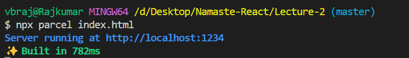
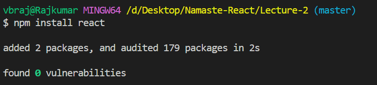
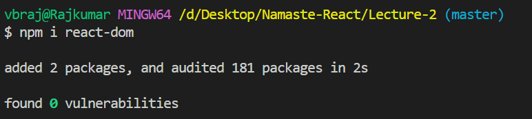

# Lecture2 notes
-  React alone will not make the application fast, we need help of lot of libraries.
-  npm doesn't stand for node package manager. [npm-website](https://npmjs.com). npm is just a huge repository for all the packages. 
-  `npm init / npm init -y`
-  package.json is a configuration of npm. 
-  Bundler is a package. Bundler is used to bundle/package the application before it's pushed to production. (**webpack**, **parcel**, and **vite** are examples of bundlers!). We'll use parcel as our bundler
-  `npm install -D parcel`
-  -D option installs parcel as a Dev dependency
- Two types of dependencies 
  - Dev dependencies(required in Development phase only)
  - Normal dependencies(required in proudction also)
- Difference between ~ and ^ in version in package.json.
- node_modules is collection of all the dependencies! Add node_modules to .gitignore file. You don't want to git to track node_modules because using **package.json** and **package-lock.json** we can re-create node_modules using `npm install`  command.
- package-lock.json will keep track of exact version. Read about **package.json** vs **package-lock.json**
- Transitive dependencies = Dependencies of Dependencies. Eg: We have parcel as a dependency, but parcel depends on other bunch of dependencies(eg : babel)!
- `npx parcel index.html`
  
  Parcel will do below things :
  - Dev build
  - Local server
  - HMR = Hot Module Replacement, done using File watching algorithm developed in C++
  - Caching = Faster builds
  - Image optimization
  - Minification
  - Bundling
  - Compressing
  - Consistent Hashing
  - Code Splitting
  - Differential Bundling to support older browsers
  - HTTPS
  - Tree shaking - remove unused code 
  - Different dev and prod bundles
- If you want to install any package we should use **npm**. If we want to execute some package we should use **npx**
- `npm install react / npm i react `
  `npm install react-dom / npm i react-dom`
  
  
  We are not using -D option, because ew don't want react to be installed as Dev dependency, we need react in production also!
  npm install / i both are will do the same.
- `npx parcel build index.html` before executing this, "main": "index.js" from package.json. This is used to build a production build. 